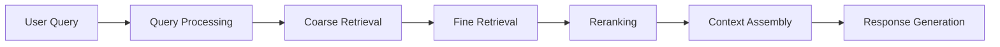

# RAG Application Architecture & MCP Server Implementation Plan

## Executive Summary
Transform the current ETL pipeline into a production-ready RAG (Retrieval-Augmented Generation) system with an MCP (Model Context Protocol) server that supports HTTP streaming for real-time, context-aware product information retrieval.

## Current State Analysis

### ✅ What We Have
1. **Vector Database Infrastructure**
   - PostgreSQL with pgvector extension (1536 dimensions)
   - Product embeddings stored and indexed
   - Semantic chunking system (4 chunk types per product)
   - HNSW indexing potential (not yet implemented)

2. **Data Model**
   - Rich product schema with metadata
   - Multi-level chunking (overview, details, specifications, usage)
   - Version hashing for change detection
   - Multi-shop support architecture

3. **Processing Pipeline**
   - Robust extraction with auto-fix mechanism
   - OpenAI embeddings generation
   - 96.4% extraction success rate

### ❌ What's Missing for Strong RAG

## Core RAG Components Required

### 1. Vector Search Layer
```typescript
interface VectorSearchRequirements {
  // Similarity search with pgvector
  semanticSearch: {
    topK: number;
    threshold: number;
    distanceMetric: 'cosine' | 'euclidean' | 'inner_product';
  };
  
  // Hybrid search combining vector + keyword
  hybridSearch: {
    vectorWeight: number;  // 0.7
    keywordWeight: number; // 0.3
    bm25Scoring: boolean;
  };
  
  // Metadata filtering
  filters: {
    shopId?: string;
    priceRange?: [number, number];
    categories?: string[];
    availability?: string[];
    brands?: string[];
  };
  
  // Reranking
  reranking: {
    crossEncoderModel?: string;
    mmrDiversification: boolean;
    diversityThreshold: number;
  };
}
```

### 2. Query Processing Pipeline
```typescript
interface QueryProcessor {
  // Query understanding
  queryExpansion: {
    synonyms: boolean;
    multilingual: boolean;
    spellCorrection: boolean;
  };
  
  // Intent detection
  intentClassification: {
    intents: ['search', 'compare', 'recommend', 'explain'];
    confidence: number;
  };
  
  // Query decomposition for complex questions
  queryDecomposition: {
    subQueries: string[];
    aggregationStrategy: 'sequential' | 'parallel';
  };
}
```

### 3. Retrieval Strategies

#### Multi-Stage Retrieval Pipeline


#### Implementation Requirements
```typescript
interface RetrievalPipeline {
  stages: {
    // Stage 1: Coarse retrieval (100-200 candidates)
    coarse: {
      method: 'vector_similarity';
      candidates: 200;
      indexType: 'hnsw';  // Fast approximate search
    };
    
    // Stage 2: Fine retrieval (20-30 candidates)
    fine: {
      method: 'hybrid_search';
      candidates: 30;
      features: ['vector', 'bm25', 'metadata'];
    };
    
    // Stage 3: Reranking (5-10 final results)
    rerank: {
      method: 'cross_encoder' | 'mmr';
      topK: 10;
      diversify: true;
    };
  };
}
```

### 4. Context Management

```typescript
interface ContextManager {
  // Dynamic context window allocation
  windowManagement: {
    maxTokens: 8192;
    reservedForResponse: 2000;
    dynamicTruncation: boolean;
  };
  
  // Context ordering strategies
  ordering: {
    strategy: 'relevance' | 'diversity' | 'recency';
    positionBias: boolean;
  };
  
  // Source attribution
  citations: {
    includeUrls: boolean;
    includeSnippets: boolean;
    confidenceScores: boolean;
  };
}
```

## MCP Server Architecture

### 1. Core Server Structure
```typescript
interface MCPServer {
  // HTTP endpoints
  endpoints: {
    '/search': 'POST',           // Main RAG search
    '/stream': 'SSE',            // Server-sent events for streaming
    '/tools': 'GET',             // List available tools
    '/health': 'GET',            // Health check
    '/metrics': 'GET'            // Performance metrics
  };
  
  // Streaming configuration
  streaming: {
    protocol: 'SSE' | 'WebSocket';
    chunkSize: 256;  // tokens
    flushInterval: 100;  // ms
  };
}
```

### 2. MCP Tool Definitions
```typescript
const mcpTools = {
  // Product search tool
  'product_search': {
    description: 'Search for products using semantic similarity',
    parameters: {
      query: 'string',
      filters: 'object',
      limit: 'number'
    }
  },
  
  // Product comparison tool
  'compare_products': {
    description: 'Compare multiple products side by side',
    parameters: {
      productIds: 'string[]',
      attributes: 'string[]'
    }
  },
  
  // Recommendation tool
  'get_recommendations': {
    description: 'Get product recommendations based on context',
    parameters: {
      context: 'string',
      userPreferences: 'object'
    }
  },
  
  // Analytics tool
  'analyze_trends': {
    description: 'Analyze product trends and patterns',
    parameters: {
      timeRange: 'string',
      metrics: 'string[]'
    }
  }
};
```

### 3. HTTP Streaming Implementation
```typescript
// Server-Sent Events for streaming responses
interface StreamingResponse {
  headers: {
    'Content-Type': 'text/event-stream';
    'Cache-Control': 'no-cache';
    'Connection': 'keep-alive';
  };
  
  events: {
    'search_started': { query: string };
    'chunks_retrieved': { count: number; sources: string[] };
    'token': { content: string };
    'citation': { source: string; url: string };
    'complete': { totalTokens: number };
    'error': { message: string };
  };
}
```

## Implementation Roadmap

### Phase 1: Core RAG Infrastructure (Week 1)
- [ ] Implement vector similarity search with pgvector
- [ ] Add HNSW index for performance
- [ ] Create hybrid search combining vector + keyword
- [ ] Implement metadata filtering system
- [ ] Add query embedding caching

### Phase 2: Advanced Retrieval (Week 2)
- [ ] Implement MMR (Maximum Marginal Relevance) for diversity
- [ ] Add cross-encoder reranking
- [ ] Create multi-stage retrieval pipeline
- [ ] Implement context window management
- [ ] Add source attribution system

### Phase 3: MCP Server (Week 3)
- [ ] Set up Express server with SSE support
- [ ] Implement MCP protocol compliance
- [ ] Create tool definitions and handlers
- [ ] Add streaming response system
- [ ] Implement session management

### Phase 4: Optimization & Testing (Week 4)
- [ ] Add Redis caching layer
- [ ] Implement connection pooling
- [ ] Create performance benchmarks
- [ ] Add monitoring and metrics
- [ ] Load testing and optimization

## Database Schema Additions

```sql
-- Query cache table
CREATE TABLE query_cache (
  id UUID PRIMARY KEY DEFAULT gen_random_uuid(),
  query_hash VARCHAR(64) NOT NULL UNIQUE,
  query_text TEXT NOT NULL,
  embedding vector(1536),
  result_ids UUID[],
  metadata JSONB,
  created_at TIMESTAMP DEFAULT CURRENT_TIMESTAMP,
  accessed_at TIMESTAMP DEFAULT CURRENT_TIMESTAMP,
  access_count INTEGER DEFAULT 1
);

-- Search analytics table
CREATE TABLE search_analytics (
  id UUID PRIMARY KEY DEFAULT gen_random_uuid(),
  session_id VARCHAR(255),
  query TEXT NOT NULL,
  results_count INTEGER,
  clicked_results UUID[],
  response_time_ms INTEGER,
  user_feedback JSONB,
  created_at TIMESTAMP DEFAULT CURRENT_TIMESTAMP
);

-- Create indexes for performance
CREATE INDEX idx_query_cache_hash ON query_cache(query_hash);
CREATE INDEX idx_query_cache_accessed ON query_cache(accessed_at);
CREATE INDEX idx_search_analytics_session ON search_analytics(session_id);
CREATE INDEX idx_search_analytics_created ON search_analytics(created_at);

-- HNSW index for vector search (if not exists)
CREATE INDEX IF NOT EXISTS product_chunks_embedding_hnsw_idx 
ON product_chunks 
USING hnsw (embedding vector_cosine_ops)
WITH (m = 16, ef_construction = 64);
```

## Performance Targets

### Search Performance
- **Latency**: < 200ms for vector search (p95)
- **Throughput**: 100+ queries/second
- **Cache Hit Rate**: > 60% for common queries
- **Streaming**: First token < 500ms

### Quality Metrics
- **Relevance**: > 0.8 nDCG@10
- **Diversity**: > 0.7 (1-redundancy)
- **Citation Accuracy**: 100%
- **Hallucination Rate**: < 1%

## Security & Compliance

### API Security
```typescript
interface SecurityConfig {
  authentication: {
    type: 'JWT' | 'API_KEY';
    rateLimit: {
      requests: 100;
      window: '1m';
    };
  };
  
  cors: {
    origins: string[];
    credentials: boolean;
  };
  
  encryption: {
    tls: true;
    minVersion: 'TLSv1.2';
  };
}
```

### Data Privacy
- Query anonymization
- PII detection and masking
- GDPR compliance for EU shops
- Audit logging

## Monitoring & Observability

### Key Metrics to Track
```typescript
interface Metrics {
  // Performance metrics
  performance: {
    searchLatency: Histogram;
    embeddingLatency: Histogram;
    streamingLatency: Histogram;
    cacheHitRate: Gauge;
  };
  
  // Quality metrics
  quality: {
    relevanceScore: Histogram;
    diversityScore: Histogram;
    userSatisfaction: Gauge;
  };
  
  // System metrics
  system: {
    activeConnections: Gauge;
    memoryUsage: Gauge;
    cpuUsage: Gauge;
    errorRate: Counter;
  };
}
```

## Example Usage

### Basic Search Request
```bash
curl -X POST http://localhost:3000/search \
  -H "Content-Type: application/json" \
  -d '{
    "query": "nachhaltige Reinigungsmittel unter 20 Euro",
    "filters": {
      "priceRange": [0, 20],
      "categories": ["Reinigungsmittel"]
    },
    "stream": true
  }'
```

### Streaming Response
```typescript
// Client-side consumption
const eventSource = new EventSource('/stream?sessionId=xxx');

eventSource.addEventListener('token', (e) => {
  const token = JSON.parse(e.data);
  appendToResponse(token.content);
});

eventSource.addEventListener('citation', (e) => {
  const citation = JSON.parse(e.data);
  addSourceReference(citation);
});

eventSource.addEventListener('complete', (e) => {
  eventSource.close();
});
```

## Next Steps

1. **Immediate Actions**
   - Review and approve architecture
   - Set up development environment
   - Create API specifications

2. **Technical Decisions**
   - Choose reranking model (cross-encoder vs. ColBERT)
   - Select caching strategy (Redis vs. in-memory)
   - Decide on monitoring stack (Prometheus/Grafana vs. DataDog)

3. **Resource Requirements**
   - GPU for reranking models (optional but recommended)
   - Redis instance for caching
   - Monitoring infrastructure
   - Load balancer for production

## Conclusion

This architecture provides a robust foundation for a production-ready RAG application with:
- **High-quality retrieval** through multi-stage pipeline
- **Real-time streaming** via MCP server
- **Scalable architecture** with caching and optimization
- **Enterprise features** including monitoring, security, and compliance

The modular design allows for incremental implementation while maintaining backward compatibility with the existing ETL pipeline.